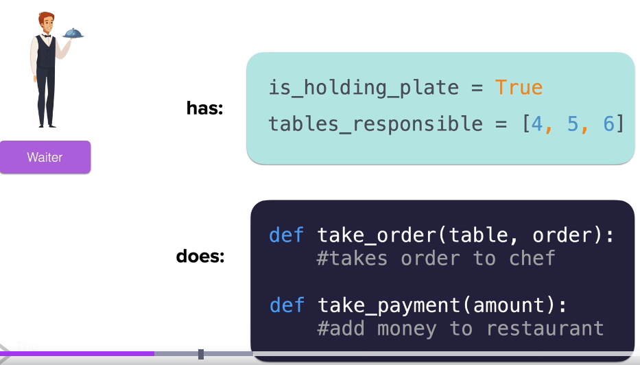
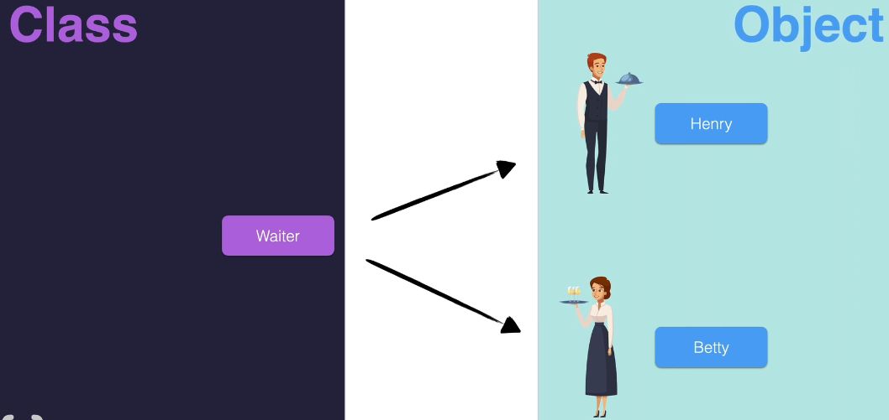

waiter -object
has - attributes - basically variables which associated with modeled objects. 
                 - They are not free-floating variables but are attached to a particular object.
does - methods   - Methods are functions that a particular modeled object can perform.

- Attributes are usually modeled with variables.
- Methods are modeled by functions.

car = carBluePrint()

car - object, carBluePrint - class