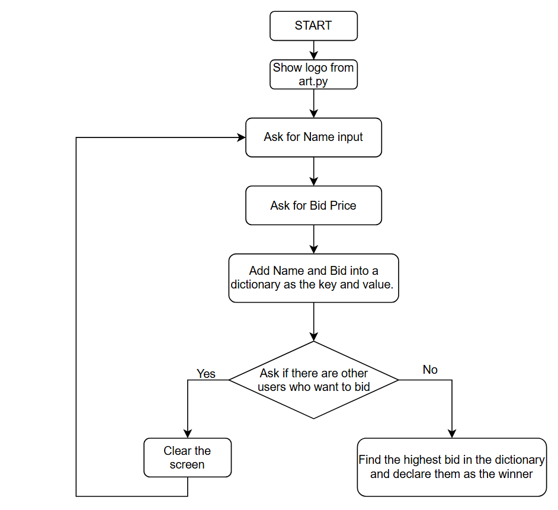

A dictionary in Python functions is similarly to a dictionary in real life. 
It's a data structure that allows to associate a key to a value and pair that
two pieces of data together.

this is how the dictionary looks like

colours = {
"apple" : "red",
"pear" : "green",
"banana" : "yellow"
}

# bid auction flow chart

